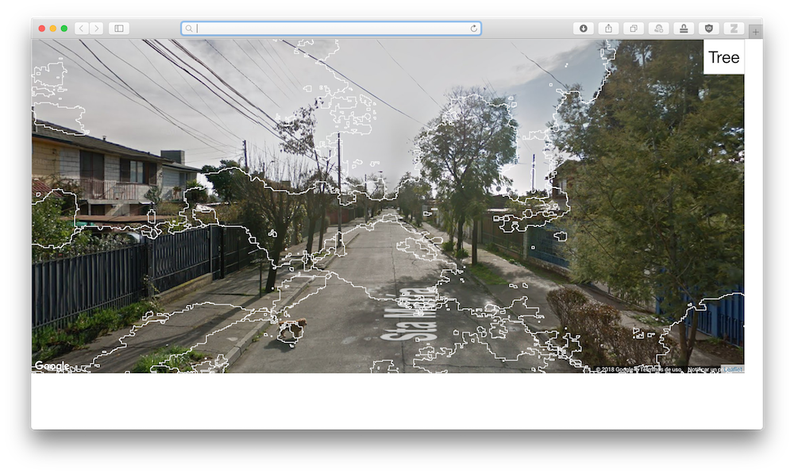

# What is this?

I'm currently working in an urban project related to perception so a experiment has been setup to know what people are looking in a test image. I created a segmentation based on segnet deep encoder-decoder architecture where the polygon generated is on top a fixed google street view image with the exact coordinates and heading of the image created before. The mouse pointer is controlled using a eye tracker and the data transmited using an api. 

